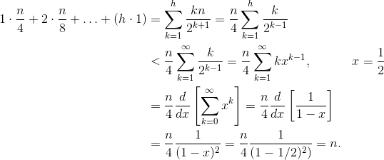

# Heap

- heapify 시간 복잡도: O(N)
- 하나씩 원소를 Binary Tree의 맨 끝에 추가하고 올리는 SiftUp 방식보다,
- 트리를 임의로 만들어놓고 아래 원소부터 모두 돌면서 child를 비교해 아래쪽으로 SiftDown하는 방식이 더 빠르게 생성할 수 있다.

Let h = log n represent the height of the heap. The work required for the siftDown approach is given by the sum

```
(0 * n/2) + (1 * n/4) + (2 * n/8) + ... + (h * 1).
```



Each term in the sum has the maximum distance a node at the given height will have to move (zero for the bottom layer, h for the root) multiplied by the number of nodes at that height. In contrast, the sum for calling siftUp on each node is

```
(h * n/2) + ((h-1) * n/4) + ((h-2) * n/8) + ... + (0 * 1).
```
